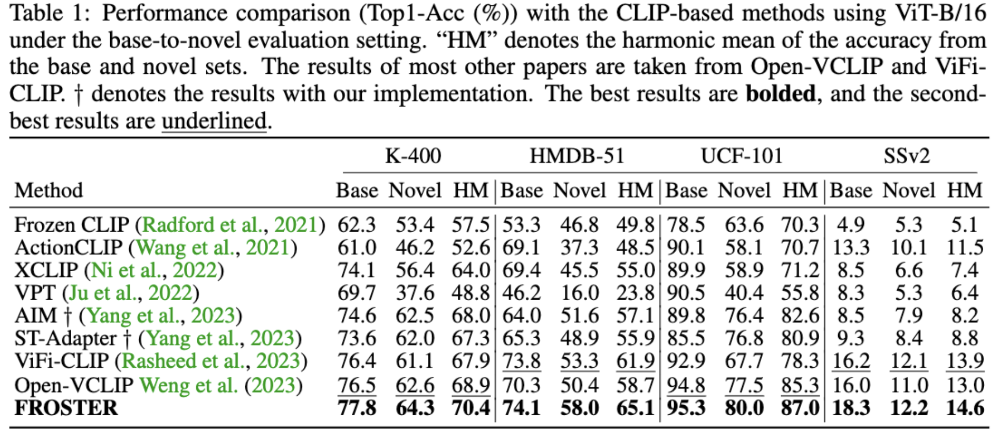
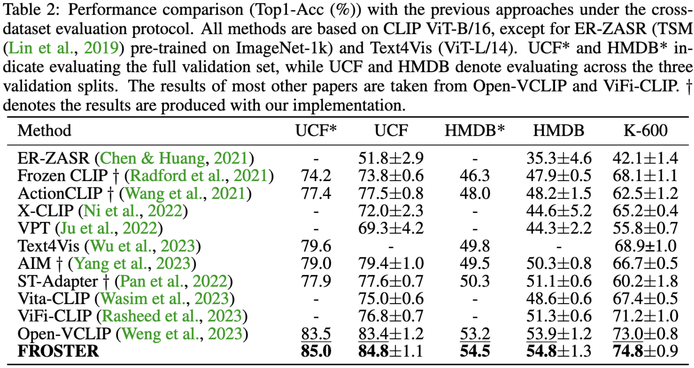

# FROSTER: Frozen CLIP is a Strong Teacher for Open-vocabulary Action Recognition

**This repository is the official implementation of ICLR2024 paper:"FROSTER: Frozen CLIP is a Strong Teacher for Open-vocabulary Action Recognition"**

Xiaohu Huang, Hao Zhou, Kun Yao, Kai Han

 [[`Paper`]](https://openreview.net/pdf?id=zYXFMeHRtO)

# Introduction

In this paper, we introduce FROSTER, an effective framework for open-vocabulary action recognition. The overall pipeline of FROSTER consists of two key components, namely, model finetuning to bridge the gap between image and video tasks, and knowledge distillation to maintain the generalizability of the pretrained CLIP.

<div class="col-sm-12" align=center>
  
</div>

# Performance
We conduct experiments on two open-vocabulary settings, i.e., base-to-novel and cross-dataset. FROSTER achieves state-of-the-art performance on both the two benchmarks.

<div align=center>
  
</div>

<div align=center>
  
</div>

# Dependency

The main dependent packages include: PyTorch 1.11.0 and torchvision 0.12.0 and [`PySlowFast`](https://github.com/facebookresearch/SlowFast)

Detailed Installation instruction can be viewed in [`INSTALL.md`](https://github.com/VisAILab/froster/blob/main/INSTALL.md).

# Data Preparation

- **Kinetics-400.** 

  We obtained the compressed version Kinetics-400 dataset, where videos have been resized to 256, from the [`VoV3d Repo`](https://github.com/youngwanLEE/VoV3D/blob/main/DATA.md#kinetics- 
  400). The repository  provides the download link for the dataset:  [[`Kinetics-400 dataset link`](https://dl.dropbox.com/s/419u0zljf2brsbt/compress.tar.gz)]. After downloading and 
  extracting the data, you should rename the folders "train_256" and "val_256" to "train" and "val" respectively. Additionally, please note that the video "val/crossing_river/ZVdAl- 
  yh9m0.mp4" is invalid and needs to be replaced. You should download a new version of the video from [`here`](https://drive.google.com/file/d/15M07kKQlZEoVzUezppITSnICs83fch8A/view? 
  usp=share_link) and perform the replacement.

- **UCF-101.**

  We download UCF-101 dataset by the [`script`](https://github.com/open-mmlab/mmaction2/blob/main/tools/data/ucf101/download_videos.sh) provided by MMAction2.

- **HMDB-51.**

  We donwload HMDB-51 dataset by the [`script`](https://github.com/open-mmlab/mmaction2/blob/main/tools/data/hmdb51/download_videos.sh) provided by MMAction2.

- **Kinetics-600 testing.**

  Validation data of Kinetics-600 we used can be donwloaded from [`link`](https://pan.baidu.com/s/1d6wI-n3igMdE1rJ2xP2MsA?pwd=c5mu ).

# Checkpoint

The pre-trained models will be uploaded soon.

# Training

- **Base-to-Novel Setting**
The training scripts are in the **script/training/temporal_b16** folder. 
Please use `train_clip_B2N_hmdb.sh`, `train_clip_B2N_k400.sh`, `train_clip_B2N_ssv2.sh` and `train_clip_B2N_ucf.sh` for the training on HMDB51, K400, SSV2, and UCF101, respectively.

Below is the training script on k400, where you need to modify the `ROOT`, `CKPT`, `DATA.PATH_TO_DATA_DIR`, `DATA.PATH_PREFIX`, `DATA.INDEX_LABEL_MAPPING_FILE`  variables to fit the paths on your server. 

```bash
ROOT=/root/paddlejob/workspace/env_run/output/xiaohu/FROSTER
CKPT=/root/paddlejob/workspace/env_run/output/xiaohu/FROSTER

# TRAIN_FILE can be set as train_1.csv or train_2.csv or train_3.csv;

B2N_k400_file=B2N_k400
TRAIN_FILE=train_1.csv
VAL_FILE=val.csv
TEST_FILE=test.csv

cd $ROOT

TORCH_DISTRIBUTED_DEBUG=INFO python -W ignore -u tools/run_net.py \
  --cfg configs/Kinetics/TemporalCLIP_vitb16_8x16_STAdapter_K400.yaml \
  --opts DATA.PATH_TO_DATA_DIR $ROOT/zs_label_db/$B2N_k400_file \
  TRAIN_FILE $TRAIN_FILE \
  VAL_FILE $VAL_FILE \
  TEST_FILE $TEST_FILE \
  DATA.PATH_PREFIX /root/paddlejob/workspace/env_run/output/xiaohu/data/k400 \
  DATA.PATH_LABEL_SEPARATOR , \
  DATA.INDEX_LABEL_MAPPING_FILE /root/paddlejob/workspace/env_run/output/xiaohu/FROSTER/zs_label_db/$B2N_k400_file/train_rephrased.json \
  TRAIN.ENABLE True \
  OUTPUT_DIR $CKPT/basetraining/B2N_k400_froster \
  TRAIN.BATCH_SIZE 32 \
  TEST.BATCH_SIZE 240 \
  TEST.NUM_ENSEMBLE_VIEWS 3 \
  TEST.NUM_SPATIAL_CROPS 1 \
  NUM_GPUS 8 \
  SOLVER.MAX_EPOCH 12 \
  SOLVER.WARMUP_EPOCHS 2.0 \
  SOLVER.BASE_LR 3.33e-6 \
  SOLVER.WARMUP_START_LR 3.33e-8 \
  SOLVER.COSINE_END_LR 3.33e-8 \
  TRAIN.MIXED_PRECISION True \
  DATA.DECODING_BACKEND "pyav" \
  MODEL.NUM_CLASSES 200 \
  MIXUP.ENABLE False \
  AUG.ENABLE False \
  AUG.NUM_SAMPLE 1 \
  TRAIN.EVAL_PERIOD 1 \
  TRAIN.CHECKPOINT_PERIOD 1 \
  MODEL.LOSS_FUNC soft_cross_entropy \
  TRAIN.LINEAR_CONNECT_CLIMB False \
  TRAIN.CLIP_ORI_PATH /root/.cache/clip/ViT-B-16.pt \
  TRAIN.LINEAR_CONNECT_LOSS_RATIO 0.0 \
  MODEL.RAW_MODEL_DISTILLATION True \
  MODEL.KEEP_RAW_MODEL True \
  MODEL.DISTILLATION_RATIO 2.0
```

- **Cross-Dataset Setting**
The training script is also in the **script/training/temporal_b16** folder. 
Please use `train_clip.sh` for the training on K400, where you also need to modify the `ROOT`, `CKPT`, `DATA.PATH_TO_DATA_DIR`, `DATA.PATH_PREFIX`, `DATA.INDEX_LABEL_MAPPING_FILE`  variables to fit the paths on your server. 

# Average the models

To improve the generalizability of your model, after training, you can use `weight_average_tool.py` to average the models from different epochs. The source folder `source_dir` should be changed according to your saved path.

```
python weight_average_tool.py
```

# Evaluation

- **Base-to-Novel Setting**
Please use `hmdb_clip_B2N.sh`, `k400_clip_B2N.sh`, `ssv2_clip_B2N.sh` and `ucf_clip_B2N.sh` for the evaluation on HMDB51, K400, SSV2, and UCF101, respectively, where you need to modify the `ROOT`, `CKPT`, `DATA.PATH_TO_DATA_DIR`, `DATA.PATH_PREFIX`, `DATA.INDEX_LABEL_MAPPING_FILE` and `LOAD_CKPT_FILE`  variables to fit the paths on your server.

Below is the evaluation script for k400 dataset.

```bash
ROOT=/root/paddlejob/workspace/env_run/output/xiaohu/FROSTER
CKPT=/root/paddlejob/workspace/env_run/output/xiaohu/FROSTER/basetraining/B2N_k400_froster

OUT_DIR=$CKPT/testing
OAD_CKPT_FILE=/root/paddlejob/workspace/env_run/output/xiaohu/FROSTER/basetraining/B2N_k400_froster/wa_checkpoints/swa_2_22.pth

# TRAIN_FILE can be set as train_1.csv or train_2.csv or train_3.csv;
# TEST_FILE can be set as val.csv (base set) or test.csv (novel set).
# rephrased_file can be set as train_rephrased.json (base set) or test_rephrased.json (novel set)
B2N_k400_file=B2N_k400
TRAIN_FILE=train_1.csv
VAL_FILE=val.csv
TEST_FILE=val.csv
rephrased_file=train_rephrased.json

cd $ROOT

python -W ignore -u tools/run_net.py \
    --cfg configs/Kinetics/TemporalCLIP_vitb16_8x16_STAdapter_K400.yaml \
    --opts DATA.PATH_TO_DATA_DIR $ROOT/zs_label_db/$B2N_k400_file \
    TRAIN_FILE $TRAIN_FILE \
    VAL_FILE $VAL_FILE \
    TEST_FILE $TEST_FILE \
    DATA.PATH_PREFIX /root/paddlejob/workspace/env_run/output/xiaohu/data/k400 \
    DATA.PATH_LABEL_SEPARATOR , \
    DATA.INDEX_LABEL_MAPPING_FILE /root/paddlejob/workspace/env_run/output/xiaohu/FROSTER/zs_label_db/B2N_k400/$rephrased_file \
    TRAIN.ENABLE False \
    OUTPUT_DIR $OUT_DIR \
    TEST.BATCH_SIZE 480 \
    NUM_GPUS 8 \
    DATA.DECODING_BACKEND "pyav" \
    MODEL.NUM_CLASSES 200 \
    TEST.CUSTOM_LOAD True \
    TEST.CUSTOM_LOAD_FILE $LOAD_CKPT_FILE \
    TEST.SAVE_RESULTS_PATH temp.pyth \
    TEST.NUM_ENSEMBLE_VIEWS 3 \
    TEST.NUM_SPATIAL_CROPS 1 \
    TEST.PATCHING_MODEL False \
    TEST.PATCHING_RATIO $PATCHING_RATIO \
    TEST.CLIP_ORI_PATH ~/.cache/clip/ViT-B-16.pt \
    DATA_LOADER.NUM_WORKERS 4 \
```

- **Cross-Dataset Setting**
Please use `hmdb_clip.sh`, `ucf_clip.sh`, and `k600_clip.sh` for the evaluation on HMDB51, UCF101, and K600, respectively, where you need to modify the `ROOT`, `CKPT`, `DATA.PATH_TO_DATA_DIR`, `DATA.PATH_PREFIX`, `DATA.INDEX_LABEL_MAPPING_FILE` and `LOAD_CKPT_FILE`  variables to fit the paths on your server.

# Acknowledgement

This repository is built upon [`OpenVCLIP`](https://github.com/wengzejia1/Open-VCLIP), [`PySlowFast`](https://github.com/facebookresearch/SlowFast) and [`CLIP`](https://github.com/openai/CLIP). Thanks for those well-organized codebases.

# Citation

```
@inproceedings{
  huang2024froster,
  title={FROSTER: Frozen CLIP is a Strong Teacher for Open-Vocabulary Action Recognition},
  author={Xiaohu Huang and Hao Zhou and Kun Yao and Kai Han},
  booktitle={International Conference on Learning Representations},
  year={2024},
  url={https://openreview.net/pdf?id=zYXFMeHRtO}
}
```
